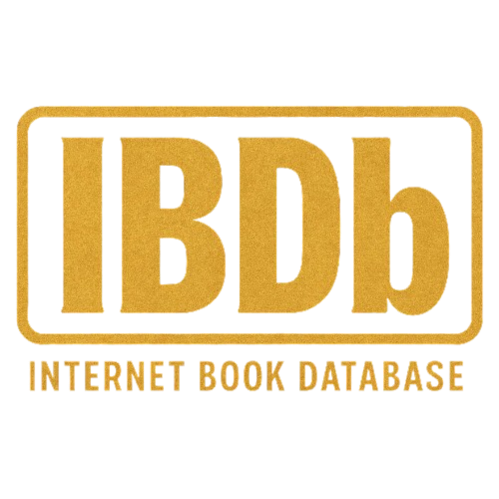

## IBDb 

A Book Review CRUD App for people to login and logout, and for them to add their own books that they've read, that they can give a review of, write a description and so on. 

Nonetheless, here's a video of me testing the local MongoDB server:

https://youtu.be/qzjU3blXvdY

05/06/2025 ; 12:13 

I added some Notes for myself on how to start up the server, meaning, opening my backend repository, opening a node server.js there, going back to the main folder, opening up a git bash there and running the mongod there too.

